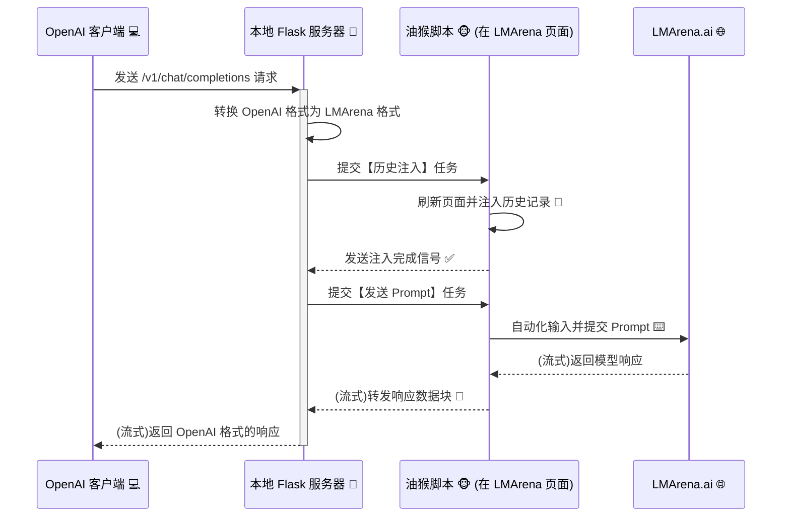

# 🚀 LMArena Automator - 全功能 OpenAI 桥接器 🌉

欢迎来到 LMArena OpenAI 桥接器项目！🎉 这是一个巧妙的工具集，它能让你通过任何兼容 OpenAI API 的客户端或应用程序，无缝使用 [LMArena.ai](https://lmarena.ai/) 平台上提供的海量大语言模型。

从此，你可以用你最喜欢的工具，体验来自全世界的顶尖或新奇的模型！🤯

## ✨ 主要功能

*   **🤖 OpenAI 兼容接口**: 在本地启动一个与 OpenAI `v1/chat/completions` 和 `v1/models` 端点完全兼容的服务器。
*   **🗣️ 完整对话历史支持**: 自动将会话历史注入到 LMArena，实现有上下文的连续对话。
*   **🌊 实时流式响应**: 像原生 OpenAI API 一样，实时接收来自模型的回应。
*   **📝 动态模型选择与自动更新**:
    *   通过 `models.json` 文件，轻松指定你想在 LMArena 上使用的任何模型。
    *   **【新】** 油猴脚本在注入历史后会自动将页面上的模型列表发回服务器，服务器会自动比较并将新模型添加到 `models.json`，无需手动维护！
*   **⚙️ 浏览器自动化**: 使用配套的油猴脚本（Tampermonkey）自动在浏览器中执行注入、输入和获取响应等操作。
*   **🔄 智能会话模式**: 能够智能检测连续对话，减少不必要的历史注入，提升效率。
*   **🍻 酒馆模式 (Tavern Mode)**: 专为SillyTavern等应用设计，每次都注入完整历史，并支持合并多个`system`提示词。
*   **🤫 Bypass 模式**: 尝试通过在请求中额外注入一个空的用户消息，绕过平台的敏感词审查。

## 🤔 它是如何工作的？

这个项目由两部分组成：一个本地 Python Flask 服务器和一个在浏览器中运行的油猴脚本。它们协同工作，形成一个完整的自动化流程。



1.  **客户端** (例如，一个使用 OpenAI API 的聊天应用) 向 **本地 Flask 服务器** 发送请求。
2.  **服务器** 接收请求，并将其从 OpenAI 格式转换为 LMArena 内部所需的格式。
3.  服务器将转换后的历史记录作为一个“注入任务”放入队列。
4.  浏览器中的 **油猴脚本** 定期向服务器请求任务，获取到注入任务后，刷新 LMArena 页面，并将历史记录“伪造”并注入到页面中。
5.  注入成功后，服务器会给油猴脚本发送下一个任务：提交用户的最新提问。
6.  油猴脚本模拟用户在 LMArena 页面的输入框中打字并点击发送。
7.  **LMArena.ai** 开始返回模型的响应。
8.  油猴脚本拦截这些响应数据，并实时地一块块发送回本地服务器。
9.  服务器再将这些数据块包装成 OpenAI API 的标准格式，实时地传回给客户端。

## ⚙️ 功能配置

所有高级功能都通过项目根目录下的 [`config.jsonc`](config.jsonc) 文件进行控制。修改此文件后，**必须重启 Python 服务器**才能生效。

```jsonc
// config.jsonc
{
  // 功能开关：绕过敏感词检测
  "bypass_enabled": true,

  // 功能开关：酒馆模式 (Tavern Mode)
  "tavern_mode_enabled": false
}
```

### 🍻 酒馆模式 (Tavern Mode)

**用途**: 此模式专为需要完整上下文注入的应用（如 SillyTavern、Oobabooga 等）设计。这些应用通常在每次请求时都会发送包含所有历史记录的完整请求体。

**工作流程**:
1.  **开启**: 在 `config.jsonc` 中将 `tavern_mode_enabled` 设置为 `true`。
    *   **重要**: 此模式与 `bypass_enabled` 互斥。启用酒馆模式后，Bypass 模式会自动禁用。
2.  **合并系统提示**: 服务器接收到请求后，会首先查找所有 `role: "system"` 的消息，并将它们的内容用换行符合并成一个单一的、最终的系统提示。
3.  **完整历史注入**: 服务器将这个处理过的、完整的消息列表（包含合并后的系统提示和其他所有用户/助手消息）作为一个注入任务发送给油猴脚本。
4.  **自动触发**: 历史注入完成后，服务器指示油猴脚本在输入框中输入一个特殊的占位符文本 (`[TAVERN_MODE_TRIGGER]`) 并点击发送。
5.  **请求净化**: 油猴脚本会拦截这个由占位符触发的网络请求，从请求体中移除这条多余的用户消息，并修正消息链，然后再将“干净”的请求发往 LMArena。
6.  **循环**: 在此模式下，每一次对话都是上述的完整循环，不使用快速通道或会话缓存。

### 🤫 Bypass 模式

**用途**: 尝试绕过LMArena平台存在的敏感词审查。

**工作流程**:
1.  **开启**: 在 `config.jsonc` 中将 `bypass_enabled` 设置为 `true` (并确保 `tavern_mode_enabled` 为 `false`)。
2.  **正常对话**: 像平时一样进行对话。
3.  **请求拦截**: 当油猴脚本准备向 LMArena 发送你的提问时，它会拦截这个请求。
4.  **注入空消息**: 在你真正的提问之前，脚本会额外插入一条内容仅为空格的用户消息。例如，请求的消息列表会从 `[..., 你的提问]` 变为 `[..., 你的提问, 一个空的用户消息]`。
5.  **发送修改请求**: 脚本将这个被修改过的请求发送出去。其原理是，平台的审查机制会转而审查这条额外的、无害的消息，从而绕过审查。

## 🛠️ 安装与使用

你需要准备好 Python 环境和一款支持油猴脚本的浏览器 (如 Chrome, Firefox, Edge)。

### 1. 准备工作

*   **安装 Python 依赖**
    打开终端，运行以下命令：
    ```bash
    pip install -r requirements.txt
    ```

*   **安装油猴脚本管理器**
    为你的浏览器安装 [Tampermonkey](https://www.tampermonkey.net/) 扩展。

*   **安装本项目油猴脚本**
    1.  打开 Tampermonkey 扩展的管理面板。
    2.  点击“添加新脚本”或“Create a new script”。
    3.  将 [`TampermonkeyScript/LMArenaAutomator.js`](TampermonkeyScript/LMArenaAutomator.js:1) 文件中的所有代码复制并粘贴到编辑器中。
    4.  保存脚本。

### 2. 运行项目

1.  **启动本地服务器**
    在项目根目录下，运行：
    ```bash
    python local_openai_history_server.py
    ```
    当你看到服务器在 `http://127.0.0.1:5102` 启动的提示时，表示服务器已准备就绪。

2.  **打开 LMArena**
    浏览器打开一个LMarena竞技场的**DirectChat的历史对话**，不要是新对话，一定要是历史对话。没有就自己整一个历史对话
    > 脚本会自动在该页面上运行并开始与本地服务器通信。

3.  **配置你的 OpenAI 客户端**
    将你的客户端或应用的 OpenAI API 地址指向本地服务器：
    *   **API Base URL**: `http://127.0.0.1:5102/v1`
    *   **API Key**: 随便填，例如 `sk-xxxxxxxx`
    *   **Model Name**: 在 [`models.json`](models.json:1) 文件中选择一个你想要使用的模型名称，例如 `claude-3-5-sonnet-20241022`。

4.  **开始聊天！** 💬
    现在你可以正常使用你的客户端了，所有的请求都会通过本地服务器代理到 LMArena 上！

## 📂 文件结构

```
.
├── .gitignore                  # Git 忽略文件
├── local_openai_history_server.py # 核心后端服务 🐍
├── models.json                 # 模型名称到 ID 的映射表 🗺️
├── requirements.txt            # Python 依赖包列表 📦
├── README.md                   # 就是你现在正在看的这个文件 👋
├── config.jsonc                # 功能配置文件 (例如：酒馆模式、Bypass模式开关) ⚙️
└── TampermonkeyScript/
    └── LMArenaAutomator.js     # 前端自动化油猴脚本 🐵
```

**享受在 LMArena 的模型世界中自由探索的乐趣吧！** 💖
