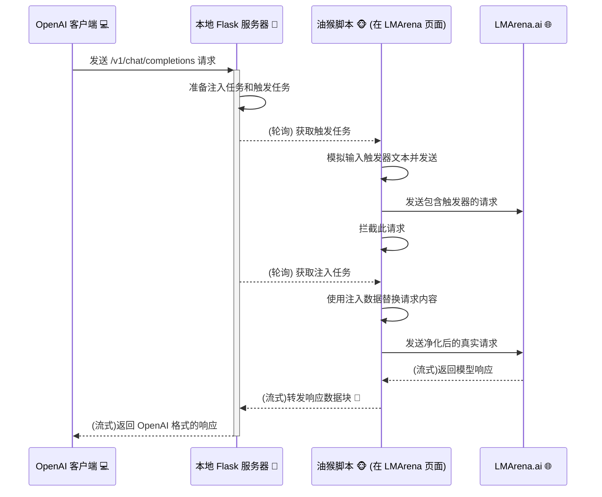

# 🚀 LMArena Automator - 全功能 OpenAI 桥接器 🌉

欢迎来到 LMArena OpenAI 桥接器项目！🎉 这是一个巧妙的工具集，它能让你通过任何兼容 OpenAI API 的客户端或应用程序，无缝使用 [LMArena.ai](https://lmarena.ai/) 平台上提供的海量大语言模型。

从此，你可以用你最喜欢的工具，体验来自全世界的顶尖或新奇的模型！🤯

## 用前须知
* 务必检测浏览器是否安装了xxBlock这种防广告插件，比如adblcok，请对5102端口放行
* 使用时突然无法使用，请刷新一下网页是不是跳人机验证了，要重新验证一下
* 如果你使用的是edge浏览器或者是其他的，需要在浏览器插件里开开发者模式给油猴，注意 不是在油猴里开开发者模式；chrome请在设置里的扩展程序中打开-允许运行用户脚本
* 检查一下你使用的应用api中是否使用的是openai格式

## ✨ 主要功能

*   **🤖 OpenAI 兼容接口**: 在本地启动一个与 OpenAI `v1/chat/completions` 和 `v1/models` 端点完全兼容的服务器。
*   **🗣️ 完整对话历史支持**: 自动将会话历史注入到 LMArena，实现有上下文的连续对话。
*   **🌊 实时流式响应**: 像原生 OpenAI API 一样，实时接收来自模型的回应。
*   **📝 静态模型配置**: 通过 `models.json` 文件，轻松指定你想在 LMArena 上使用的模型。
*   **🔄 自动模型更新**: 启动时自动从 LMArena 页面获取最新的模型列表，与本地 `models.json` 对比，并在需要时自动更新文件。
*   **⚙️ 浏览器自动化**: 使用配套的油猴脚本（Tampermonkey）自动在浏览器中执行输入和获取响应等操作。
*   **🍻 酒馆模式 (Tavern Mode)**: 专为SillyTavern等应用设计，每次都注入完整历史，并支持合并多个`system`提示词。
*   **🤫 Bypass 模式**: 尝试通过在请求中额外注入一个空的用户消息，绕过平台的敏感词审查。
*   **📜 聚合日志系统**: 强大的调试工具，可将服务器和浏览器脚本的所有日志聚合到单个带时间戳的文件中，轻松追踪完整请求生命周期。

## ⚙️ 功能配置

所有高级功能都通过项目根目录下的 [`config.jsonc`](config.jsonc) 文件进行控制。修改此文件后，**必须重启 Python 服务器**才能生效。

```jsonc
// config.jsonc
{
  // 功能开关：Bypass 模式
  "bypass_enabled": false,

  // 功能开关：酒馆模式 (Tavern Mode)
  "tavern_mode_enabled": true,

  // --- 日志与调试 ---

  // 开关：服务器请求体日志
  "log_server_requests": true,

  // 开关：油猴脚本调试日志
  "log_tampermonkey_debug": false,

  // 开关：聚合日志总开关
  "enable_comprehensive_logging": true
}
```

### 功能详解

| 配置项                       | 类型    | 默认值 | 描述                                                                                                                                                             |
| ---------------------------- | ------- | ------ | ---------------------------------------------------------------------------------------------------------------------------------------------------------------- |
| `bypass_enabled`             | `boolean` | `false`  | **Bypass 模式**。启用后，**服务器**会在最终发送给 LMArena 的消息列表末尾追加一条空的用户消息，尝试绕过敏感词审查。                                                |
| `tavern_mode_enabled`        | `boolean` | `false`  | **酒馆模式**。专为 SillyTavern 等应用设计，每次请求都会合并所有 `system` 提示并注入完整历史记录。                                                              |
| `log_server_requests`        | `boolean` | `false`  | 启用后，Python 服务器会在控制台打印接收到的完整 OpenAI 请求体，方便调试。                                                                                         |
| `log_tampermonkey_debug`     | `boolean` | `false`  | 启用后，油猴脚本会在浏览器控制台输出更详细的内部工作流程日志。                                                                                                   |
| `enable_comprehensive_logging` | `boolean` | `false`  | **聚合日志总开关**。启用后，服务器和油猴脚本的所有日志都会被记录到项目根目录下 `Debug/` 文件夹中的一个带时间戳的 `.log` 文件里。**强烈推荐在遇到问题时开启**。 |

### 🍻 酒馆模式 (Tavern Mode)

**用途**: 此模式专为需要完整上下文注入的应用（如 SillyTavern、Oobabooga 等）设计。

**工作流程**:
1.  **开启**: 在 `config.jsonc` 中将 `tavern_mode_enabled` 设置为 `true`。
2.  **合并系统提示**: 服务器接收到请求后，会首先查找所有 `role: "system"` 的消息，并将它们的内容合并成一个单一的系统提示。
3.  **完整历史注入**: 服务器将这个处理过的、完整的消息列表作为一个注入任务发送给油猴脚本。
4.  **自动触发**: 历史注入完成后，服务器指示油猴脚本在输入框中输入一个特殊的触发器文本 (`[这条消息仅起占位，请以外部应用中显示的内容为准：/...]`) 并点击发送。
5.  **请求拦截与净化**: 油猴脚本会拦截这个由触发器触发的请求，用服务器准备好的完整历史记录替换掉它，然后再将“干净”的请求发往 LMArena。

### 🤫 Bypass 模式

**用途**: 尝试绕过 LMArena 平台可能存在的敏感词审查。

**工作流程**:
1.  **开启**: 在 `config.jsonc` 中将 `bypass_enabled` 设置为 `true`。
2.  **服务器端注入**: 当服务器处理来自 OpenAI 客户端的请求时，它会在构造发送给 LMArena 的消息列表时，在**末尾**自动添加一条内容为空格的用户消息 (`{"role": "user", "content": " "}`)。
3.  **发送修改请求**: 包含这条额外消息的请求被发送到 LMArena。其原理是，平台的审查机制可能会转而审查这条无害的附加消息，从而可能绕过对主要内容的审查。

## 🛠️ 安装与使用

你需要准备好 Python 环境和一款支持油猴脚本的浏览器 (如 Chrome, Firefox, Edge)。

### 1. 准备工作

*   **安装 Python 依赖**
    打开终端，运行以下命令：
    ```bash
    pip install -r requirements.txt
    ```

*   **安装油猴脚本管理器**
    为你的浏览器安装 [Tampermonkey](https://www.tampermonkey.net/) 扩展。

*   **安装本项目油猴脚本**
    1.  打开 Tampermonkey 扩展的管理面板。
    2.  点击“添加新脚本”或“Create a new script”。
    3.  将 [`TampermonkeyScript/LMArenaAutomator.js`](TampermonkeyScript/LMArenaAutomator.js) 文件中的所有代码复制并粘贴到编辑器中。
    4.  保存脚本。

### 2. 运行项目

1.  **启动本地服务器**
    在项目根目录下，运行：
    ```bash
    python local_openai_history_server.py
    ```
    当你看到服务器在 `http://127.0.0.1:5102` 启动的提示时，表示服务器已准备就绪。

2.  **打开 LMArena**
    在浏览器中打开一个 LMArena 竞技场的 **Direct Chat 历史对话页面**。必须是已存在的对话，否则脚本可能无法正确挂载。
    > 脚本会自动在该页面上运行并开始与本地服务器通信。

3.  **配置你的 OpenAI 客户端**
    将你的客户端或应用的 OpenAI API 地址指向本地服务器：
    *   **API Base URL**: `http://127.0.0.1:5102/v1`
    *   **API Key**: 随便填，例如 `sk-xxxxxxxx`
    *   **Model Name**: 在 [`models.json`](models.json) 文件中选择一个你想要使用的模型名称。

4.  **开始聊天！** 💬
    现在你可以正常使用你的客户端了，所有的请求都会通过本地服务器代理到 LMArena 上！

## 🤔 它是如何工作的？

这个项目由两部分组成：一个本地 Python Flask 服务器和一个在浏览器中运行的油猴脚本。它们协同工作，形成一个完整的自动化流程。



1.  **客户端** (例如，一个聊天应用) 向 **本地 Flask 服务器** 发送标准 OpenAI 请求。
2.  **服务器** 接收请求，将其转换为 LMArena 格式，并创建两个任务：一个【注入任务】（包含完整对话历史）和一个【触发任务】（包含一个独特的ID）。
3.  浏览器中的 **油猴脚本** 定期向服务器轮询【触发任务】。
4.  获取到任务后，油猴脚本会在 LMArena 页面的输入框中输入触发文本并点击发送。
5.  同时，油猴脚本会**拦截**自己刚刚发送的这个网络请求。
6.  脚本接着向服务器请求【注入任务】，获取到完整的、格式化好的对话历史。
7.  它将拦截到的请求内容**替换**为这份完整的对话历史，然后将这个“净化”过的请求发送给 **LMArena.ai**。
8.  LMArena 开始返回模型的响应。
9.  油猴脚本拦截这些响应数据，并实时地一块块发送回本地服务器。
10. 服务器再将这些数据块包装成 OpenAI API 的标准格式，实时地传回给客户端。

## 📂 文件结构

```
.
├── .gitignore                  # Git 忽略文件
├── local_openai_history_server.py # 核心后端服务 🐍
├── models.json                 # 模型名称到 ID 的映射表 🗺️
├── requirements.txt            # Python 依赖包列表 📦
├── README.md                   # 就是你现在正在看的这个文件 👋
├── config.jsonc                # 功能配置文件 ⚙️
└── TampermonkeyScript/
    └── LMArenaAutomator.js     # 前端自动化油猴脚本 🐵
```

**享受在 LMArena 的模型世界中自由探索的乐趣吧！** 💖
