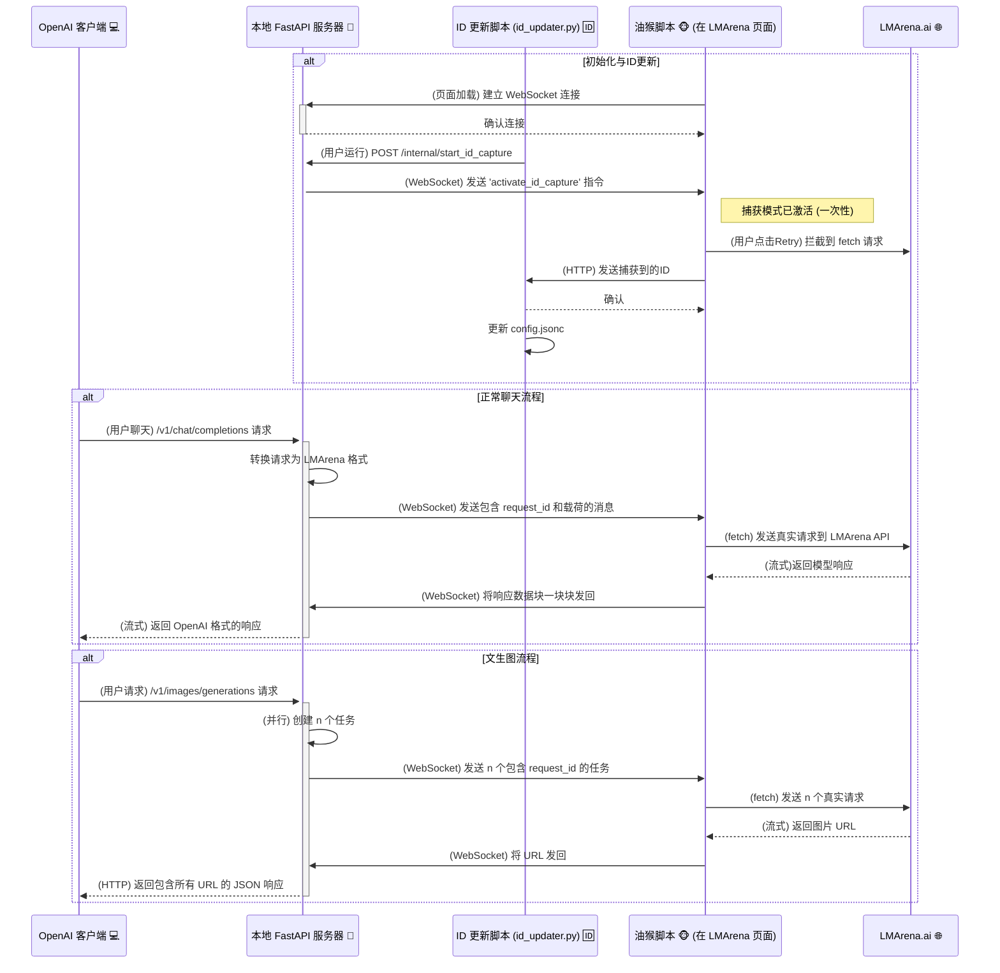

# 🚀 LMArena Bridge - 新一代 OpenAI 桥接器 🌉

欢迎来到新一代的 LMArena Bridge！🎉 这是一个基于 FastAPI 和 WebSocket 的高性能工具集，它能让你通过任何兼容 OpenAI API 的客户端或应用程序，无缝使用 [LMArena.ai](https://lmarena.ai/) 平台上提供的海量大语言模型。

这个重构版本旨在提供更稳定、更易于维护和扩展的体验。

## ✨ 主要功能

*   **🚀 高性能后端**: 基于 **FastAPI** 和 **Uvicorn**，提供异步、高性能的 API 服务。
*   **🔌 稳定的 WebSocket 通信**: 使用 WebSocket 替代 Server-Sent Events (SSE)，实现更可靠、低延迟的双向通信。
*   **🤖 OpenAI 兼容接口**: 完全兼容 OpenAI `v1/chat/completions`、`v1/models` 以及 `v1/images/generations` 端点。
*   **🎨 文生图支持**: 新增文生图功能，可通过标准 OpenAI 接口调用 LMArena 的图像生成模型。
*   **🗣️ 完整对话历史支持**: 自动将会话历史注入到 LMArena，实现有上下文的连续对话。
*   **🌊 实时流式响应**: 像原生 OpenAI API 一样，实时接收来自模型的文本回应。
*   **🔄 自动模型与程序更新**:
    *   启动时自动从 LMArena 页面获取最新的模型列表，并智能更新 `models.json`。
    *   启动时自动检查 GitHub 仓库，发现新版本时可自动下载并更新程序。
*   **🆔 一键式会话ID更新**: 提供 `id_updater.py` 脚本，只需在浏览器操作一次，即可自动捕获并更新 `config.jsonc` 中所需的会话 ID。
*   **⚙️ 浏览器自动化**: 配套的油猴脚本 (`LMArenaApiBridge.js`) 负责与后端服务器通信，并在浏览器中执行所有必要操作。
*   **🍻 酒馆模式 (Tavern Mode)**: 专为 SillyTavern 等应用设计，智能合并 `system` 提示词，确保兼容性。
*   **🤫 Bypass 模式**: 尝试通过在请求中额外注入一个空的用户消息，绕过平台的敏感词审查。
*   **🔐 API Key 保护**: 可在配置文件中设置 API Key，为你的服务增加一层安全保障。

## 🛠️ 安装与使用

你需要准备好 Python 环境和一款支持油猴脚本的浏览器 (如 Chrome, Firefox, Edge)。

### 1. 准备工作

*   **安装 Python 依赖**
    打开终端，进入项目根目录，运行以下命令：
    ```bash
    pip install -r requirements.txt
    ```

*   **安装油猴脚本管理器**
    为你的浏览器安装 [Tampermonkey](https://www.tampermonkey.net/) 扩展。

*   **安装本项目油猴脚本**
    1.  打开 Tampermonkey 扩展的管理面板。
    2.  点击“添加新脚本”或“Create a new script”。
    3.  将 [`TampermonkeyScript/LMArenaApiBridge.js`](TampermonkeyScript/LMArenaApiBridge.js) 文件中的所有代码复制并粘贴到编辑器中。
    4.  保存脚本。

### 2. 运行主程序

1.  **启动本地服务器**
    在项目根目录下，运行主服务程序：
    ```bash
    python api_server.py
    ```
    当你看到服务器在 `http://127.0.0.1:5102` 启动的提示时，表示服务器已准备就绪。

2.  **保持 LMArena 页面开启**
    确保你至少有一个 LMArena 页面是打开的，并且油猴脚本已成功连接到本地服务器（页面标题会以 `✅` 开头）。这里无需保持在对话页面，只要是域名下的页面都可以LeaderBoard都可以。

### 3. 配置会话 ID (需要时，一般只配置一次即可，除非切换模型或者原对话失效)

这是**最重要**的一步。你需要获取一个有效的会话 ID 和消息 ID，以便程序能够正确地与 LMArena API 通信。

1.  **确保主服务器正在运行**
    `api_server.py` 必须处于运行状态，因为 ID 更新器需要通过它来激活浏览器的捕获功能。

2.  **运行 ID 更新器**
    打开**一个新的终端**，在项目根目录下运行 `id_updater.py` 脚本：
    ```bash
    python id_updater.py
    ```
    *   脚本会提示你选择模式 (DirectChat / Battle)。
    *   选择后，它会通知正在运行的主服务器。

3.  **激活与捕获**
    *   此时，你应该会看到浏览器中 LMArena 页面的标题栏最前面出现了一个准星图标 (🎯)，这表示**ID捕获模式已激活**。
    *   在浏览器中打开一个 LMArena 竞技场的 **目标模型发送给消息的页面**。请注意，如果是Battle页面，请不要查看模型名称，保持匿名状态，并保证当前消息界面的最后一条是目标模型的一个回答；如果是Direct Chat，请保证当前消息界面的最后一条是目标模型的一个回答。
    *   **点击目标模型的回答卡片右上角的重试（Retry）按钮**。
    *   油猴脚本会捕获到 `sessionId` 和 `messageId`，并将其发送给 `id_updater.py`。

4.  **验证结果**
    *   回到你运行 `id_updater.py` 的终端，你会看到它打印出成功捕获到的 ID，并提示已将其写入 `config.jsonc` 文件。
    *   脚本在成功后会自动关闭。现在你的配置已完成！

3.  **配置你的 OpenAI 客户端**
    将你的客户端或应用的 OpenAI API 地址指向本地服务器：
    *   **API Base URL**: `http://127.0.0.1:5102/v1`
    *   **API Key**: 如果 `config.jsonc` 中的 `api_key` 为空，则可随便输入；如果已设置，则必须提供正确的 Key。
    *   **Model Name**: 模型现在不再由本地决定，而是由你再LMArena对话中，重试（Retry）的那条消息所决定。所以务必提前在对话或者Battle中找到你想要的模型的对话。DirectChat可以使用DC大佬提供的**LMArenaDirectChat模型注入 (仙之人兮列如麻) V5.js**这个油猴脚本来确定你想用的模型（wolfstride等最新测试模型可能无法直接对话，必须在Battle里进行捕捉）。

4.  **开始聊天！** 💬
    现在你可以正常使用你的客户端了，所有的请求都会通过本地服务器代理到 LMArena 上！

## 🤔 它是如何工作的？

这个项目由两部分组成：一个本地 Python **FastAPI** 服务器和一个在浏览器中运行的**油猴脚本**。它们通过 **WebSocket** 协同工作。



1.  **建立连接**: 当你在浏览器中打开 LMArena 页面时，**油猴脚本**会立即与**本地 FastAPI 服务器**建立一个持久的 **WebSocket 连接**。
    > **注意**: 当前架构假定只有一个浏览器标签页在工作。如果打开多个页面，只有最后一个连接会生效。
2.  **接收请求**: **OpenAI 客户端**向本地服务器发送标准的聊天请求。
3.  **任务分发**: 服务器接收到请求后，会将其转换为 LMArena 需要的格式，并附上一个唯一的请求 ID (`request_id`)，然后通过 WebSocket 将这个任务发送给已连接的油猴脚本。
4.  **执行与响应**: 油猴脚本收到任务后，会直接向 LMArena 的 API 端点发起 `fetch` 请求。当 LMArena 返回流式响应时，油猴脚本会捕获这些数据块，并将它们一块块地通过 WebSocket 发回给本地服务器。
5.  **响应中继**: 服务器根据每块数据附带的 `request_id`，将其放入正确的响应队列中，并实时地将这些数据流式传输回 OpenAI 客户端。

## 📖 API 端点

### 获取模型列表

*   **端点**: `GET /v1/models`
*   **描述**: 返回一个与 OpenAI 兼容的模型列表，该列表从 `models.json` 文件中读取。

### 聊天补全

*   **端点**: `POST /v1/chat/completions`
*   **描述**: 接收标准的 OpenAI 聊天请求，支持流式和非流式响应。

### 图像生成

*   **端点**: `POST /v1/images/generations`
*   **描述**: 接收标准的 OpenAI 文生图请求，返回生成的图片 URL。
*   **请求示例**:
    ```bash
    curl http://127.0.0.1:5102/v1/images/generations \
      -H "Content-Type: application/json" \
      -d '{
        "prompt": "A futuristic cityscape at sunset, neon lights, flying cars",
        "n": 2,
        "model": "dall-e-3"
      }'
    ```
*   **响应示例**:
    ```json
    {
      "created": 1677663338,
      "data": [
        {
          "url": "https://..."
        },
        {
          "url": "https://..."
        }
      ]
    }
    ```

## 📂 文件结构

```
.
├── .gitignore                  # Git 忽略文件
├── api_server.py               # 核心后端服务 (FastAPI) 🐍
├── id_updater.py               # 一键式会话ID更新脚本 🆔
├── test_image_generation.py    # 文生图功能测试脚本 🧪
├── models.json                 # 模型名称到 ID 的映射表 🗺️
├── requirements.txt            # Python 依赖包列表 📦
├── README.md                   # 就是你现在正在看的这个文件 👋
├── config.jsonc                # 功能配置文件 ⚙️
├── modules/
│   ├── image_generation.py     # 文生图模块 🎨
│   └── update_script.py        # 自动更新逻辑脚本 🔄
└── TampermonkeyScript/
    └── LMArenaApiBridge.js     # 前端自动化油猴脚本 🐵
```

**享受在 LMArena 的模型世界中自由探索的乐趣吧！** 💖
